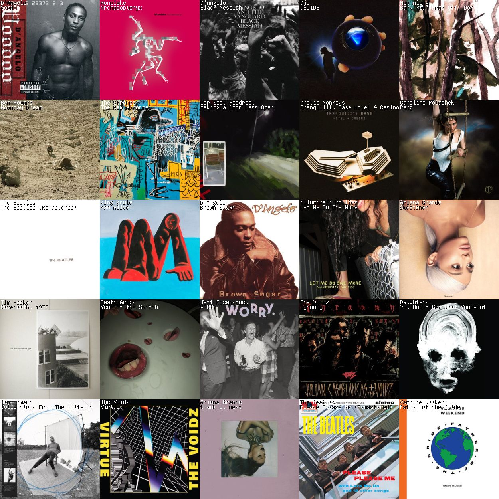
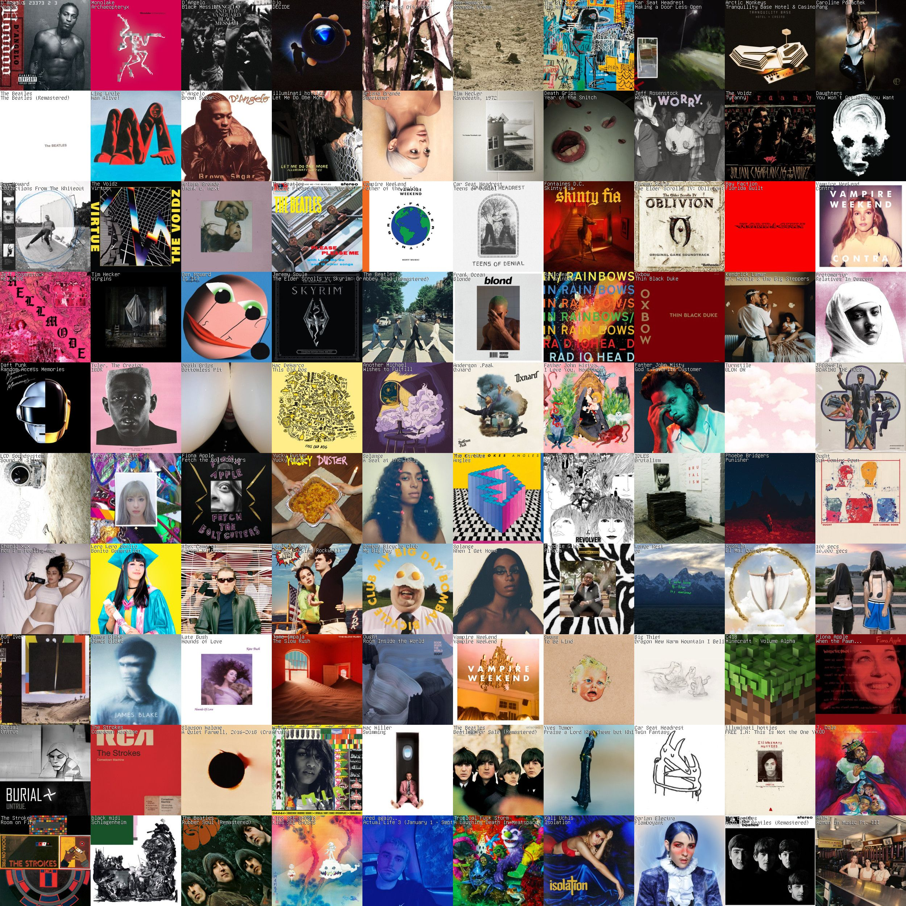

# My favourites

## Favourite blog posts

- Sasha's Chapin's "[Notes Against Note-Taking Systems](https://sashachapin.substack.com/p/notes-against-note-taking-systems)"
    - Great short treatus on the perils of being nerd-sniped, being left-hemisphere captured and in optimiser/yak-shaving mode, rather than just making stuff. "Most great writing comes from channeling what is in the air at this very moment", or something to that affect. (Effect? Man, writing with no internet is hard, lol).
- Michael Nielsen's "[Augmenting Long-Term Memory](https://augmentingcognition.com/ltm.html)" - the best write up about anki I've seen. Memorisation gets a very bad rap but is so so underrated and essential IMO.
- [Sasha Chapin's "Loving Awareness as Anti-Meme](https://sashachapin.substack.com/p/loving-awareness-as-anti-meme)" - love this concept, and love the description of how all spiritual/mystical traditions seem to converge at the same point.

## Favourite videos
- [This is Water](https://www.youtube.com/watch?v=DCbGM4mqEVw&pp=0gcJCdgAo7VqN5tD) - I love David Foster Wallace with all my heart. This commencement speech he did is gorgeous, and really summarises his life philosophy/approach to fiction. I wish here was still here to see tpot/the post-rat space, he was so prophetic and kind, despite it all.
    - Re: DFW, I'm so grateful that this [archive of all his interviews](https://www.dfwaudioproject.org/interviews-profiles) exists. His 2 interviews with Charlie Rose, and his interviews with Bookworm, are really really great

## Favourite books
- DFW's body of work, of course. I think his short story collection "Oblivion" is the best place to start.
- Atlas Shrugged is so good
- Honestly I don't read as much fiction as I should, but I really liked Donna Tartt's "The Secret History" recently, one I'd love to re-read.

## Favourite music
- Kendrick Lamar is my #1 artist of all time, just incredible. 
- I also really like, let's see... Fiona Apple, D'Angelo, Radiohead/The Smile, Adrienne Lenker/Big Thief, Hop Along, Ben Howard, Bon Iver, Bay Faction, The Strokes/The Voidz!!!
- I had a huge music nerd era and it's sadly died away because I can't work to music and I don't have a car, and podcasts have subsumed music during down time. Looking forward to returning and catching up on all the stuff I've missed out on!!

- My 25 most listened to albums, via LastFM

- My 100 most listened to albums, via LastFM

## Favourite podcasts
- Comedy podcasts have been my "guilty pleasure" for years, only recently converted to non-guilty, because it's important to have chill downtime (I just can't listen to nonfiction podcasts or audiobooks in my non-work hours)
- I absolutely love My Dad Wrote a Porno, although I sadly have listened to it so many times that it's lost its sheen
- The web series "Jake and Amir" was very formative re: my sense of humour, and I've listened to their comedy network (Headgum) for years. If I Were You, the Headgum podcast, Review Revue. I lived in Albania for a month and listened to Review Revue for like 4 hours a day whilst walking around